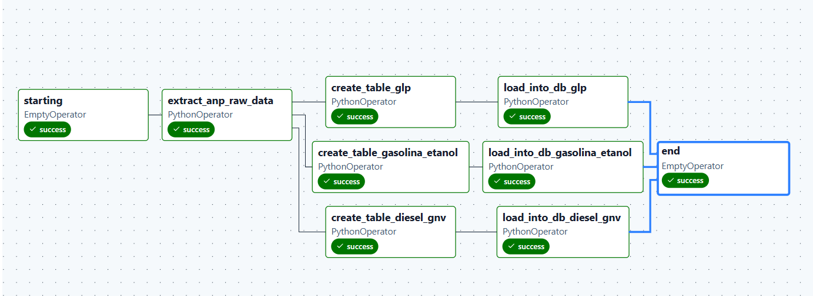

# Airflow & Astro CLI

## Astro CLI
- instalado no windows mesmo via linha de comando com winget:
    - `winget install -e --id Astronomer.Astro`
    - buildar o airflow de forma mais simples

### Iniciando o astrocli:
- Após instalado, no repositório basta executar `astro dev init`
- Será criado as seguintes pastas no diretório:
```powershell
    Diretório: ...\projeto-airflow-dbt
Mode                 LastWriteTime         Length Name
----                 -------------         ------ ----
d-----        21/01/2026     22:49                .astro
d-----        21/01/2026     22:49                dags
d-----        21/01/2026     22:49                include
d-----        21/01/2026     22:49                plugins
d-----        21/01/2026     22:49                tests
-a----        21/01/2026     22:49             73 .dockerignore
-a----        21/01/2026     22:49              0 .env
-a----        21/01/2026     22:49            132 .gitignore
-a----        21/01/2026     22:49            866 airflow_settings.yaml
-a----        21/01/2026     22:49             45 Dockerfile
-a----        21/01/2026     22:49              0 packages.txt
-a----        21/01/2026     22:49            155 requirements.txt
```
### Comandos Astro:
1. Iniciar o diretorio: `astro dev init`
2. Startar o servico: `astro dev start`
    - Executa o airflow (necessario o docker ativo)
3. Parar de rodar: `astro dev stop`
4. Reiniciar o servico: `astro dev restart`
5. Rodar comandos bash no container: `astro dev bash` && `ls`
6. Encerrar o container e deletar todo os metadados e dados do database: `astro dev kill`
7. Rodar determinada dag: `astro run <dag-id>`

### Conexao com postgres:
- Adicionado no requirements.txt:
    - apache-airflow-providers-postgres
    - psycopg2-binary
- Conexao criada diretamente via UI do Airflow:
    - connectionid: postgres_raw
    - postgres / postgres / postgres / porta 5432

### DBT
- Pra executar o dbt, precisei adicionar no packages.txt o `git` (usa o apt-get)
    - o dbt exige que tenha e no astroCLI nao vem por padrao
    - Ao rodar dbt debug no projeto criado (antes de incluir o git no packages):
```
astro@f54a03cc3488:/usr/local/airflow/include/dbt/dbt_anp_project$ dbt debug
01:22:37  Running with dbt=1.11.2
01:22:37  dbt version: 1.11.2
01:22:37  python version: 3.12.12
01:22:37  python path: /usr/local/bin/python
01:22:37  os info: Linux-6.6.87.2-microsoft-standard-WSL2-x86_64-with-glibc2.36
01:22:37  Using profiles dir at /usr/local/airflow/include/dbt/dbt_anp_project
01:22:37  Using profiles.yml file at /usr/local/airflow/include/dbt/dbt_anp_project/profiles.yml
01:22:37  Using dbt_project.yml file at /usr/local/airflow/include/dbt/dbt_anp_project/dbt_project.yml
01:22:37  adapter type: postgres
01:22:37  adapter version: 1.10.0
01:22:38  Configuration:
01:22:38    profiles.yml file [OK found and valid]
01:22:38    dbt_project.yml file [OK found and valid]
01:22:38  Required dependencies:
01:22:38   - git [ERROR] <<<<<<<<<<<<<<<<<<<<<<<<<<<<<<<<<<<<<<<<

01:22:38  Connection:
01:22:38    host: postgres
01:22:38    port: 5432
01:22:38    user: postgres
01:22:38    database: postgres
01:22:38    schema: public
01:22:38    connect_timeout: 10
01:22:38    role: None
01:22:38    search_path: None
01:22:38    keepalives_idle: 0
01:22:38    sslmode: None
01:22:38    sslcert: None
01:22:38    sslkey: None
01:22:38    sslrootcert: None
01:22:38    application_name: dbt
01:22:38    retries: 1
01:22:38  Registered adapter: postgres=1.10.0
01:22:38    Connection test: [OK connection ok]
```

### Execucao DAG:
- Conecta carrega os dados, salva local no container, cria as tabelas, pega os daos local e append nas tabelas.

- Conectar no postgres dentro do container do astro:
    - `astro dev bash` && `psql -h postgres -U postgres -d postgres`
        - -h hostname // -U username //-d dbname -> [ref](https://www.postgresql.org/docs/current/app-psql.html)


### Criando com Cosmos
- Criar pasta .dbt na raíz
    - add profiles.yml
- add astronomer-cosmos no requirements
- instalando dbt via dockerfile
- include/profiles.py
- na pasta de dag: `dbt init dbt_anp`
- criar uma dag .py (`dags\dbt_dag.py`) pra criar as tasks e tudo via dbt usando cosmos


# Referência:
- [Video do DataWay](https://www.youtube.com/watch?v=cET2DwVhnc4)